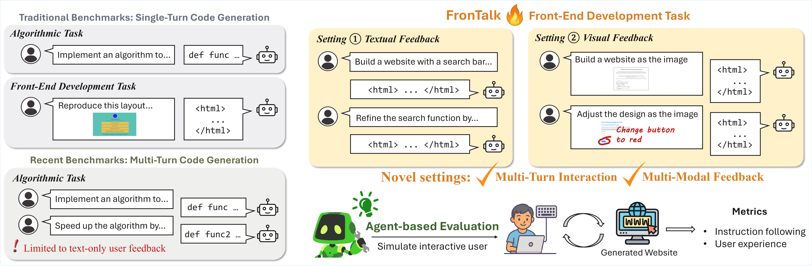
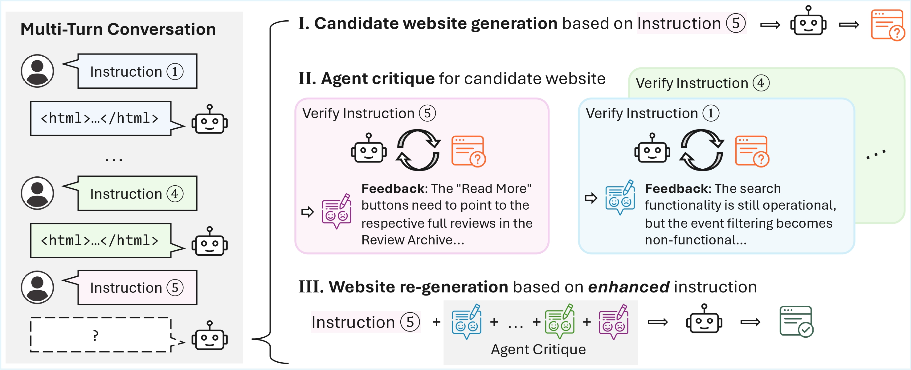

# FronTalk

**Benchmarking Front-End Development as Conversational Code Generation with Multi-Modal Feedback**

[🌐 Project](https://frontalk-benchmark.github.io/) | [🤗 Dataset](https://huggingface.co/datasets/xqwu/FronTalk) | [📖 Paper](https://arxiv.org/abs/2601.04203)

<br/>

Outline:
* [Introduction](#introduction)
* [Data](#data)
* [Installation](#installation)
* [Code](#code)
* [ACECoder](#acecoder)

## Introduction

**FronTalk** is the first **multi-turn** benchmark for front-end coding, featuring:
1. **1000 turns across 100 dialogues**, consisting derived from real-world websites across diverse domains, and **3676 test cases** to evaluate instruction following accuracy.
2. **User simulator** powered by LLM to produce either **textual** or **visual** user instructions based on pre-curated user intents and dynamic conversational context.
3. **Agent-based evaluation** that uses a web agent to evaluate pass rate (based on test cases) and user experience.



## Data

The data is in the repo [here](https://github.com/shirley-wu/frontalk/blob/main/data.jsonl) and at [huggingface](https://huggingface.co/datasets/xqwu/FronTalk). The data structure is as follows. Each data contains a summary of website goal, 10 turns of user intents, and the test cases associated with each turn.
```json
{
  "id": "e4aa9d67d4a5e40cdffac7a3429994a8.html",
  "summary": {
    "purpose": "The website serves as an informational and promotional platform for PET Engineering College, providing..."
  },
  "cases": [
    {
      "instructions": "Build a website for PET Engineering College to serve as an informational and promotional hub. Include an \"Event Calendar\"...",
      "test_conditions": [
        {
          "condition": "Verify that the \"Event Calendar\" page is accessible from the homepage.",
          "pass": "The \"Event Calendar\" page is accessible from the homepage via clicking specific links or buttons.",
          "fail": "The page is missing or not accessible from the homepage."
        },
        ...CASES...
      ]
    },
    ...TURNS... (In total: 10 turns)
  ]
}
```

## Installation

To setup pip environment:
```bash
pip install -r requirements.txt
```

If you don't have built-in Chrome, you may need to install [chrome by testing](https://googlechromelabs.github.io/chrome-for-testing/) manually, and pass the  location to `chrome` and `chromedriver` to function `def get_default_driver` in `webvoyager/run.py` as arguments `binary_location` and `service_location`. You may also set environment path `CHROME_BINARY` and `CHROME_DRIVER` and the script will automatically access the path.

Additionally, please check that your system has font for emojis (as they are usually needed for front-end development). For example, you can install Noto Color Emoji by `sudo apt install fonts-noto-color-emoji`.

Note that **this requirement does not include requirements for fast serving frameworks** such as vllm, lmdeploy and sglang. To install these packages, please install pytorch and vllm according to their documentations.

## Code

### Inference

Run inference by `python infer_multiturn_textual.py` for textual instructions or `python infer_multiturn_visual.py` for visual instructions. The code will use `openai.OpenAI` client to request OpenAI server or OpenAI-compatible servers (e.g. served by vLLM).

Command line args:
* `out_dirname`: output dirname. The intermediate outputs from each turn will be stored under `out_dirname/t.?/`. The final output will be `out_dirname/t.9/`.
* `--local_openai_key`: your openai key. If left empty, the code will use the `OPENAI_API_KEY` environment argument.
* `--local_openai_port`: one or multiple ports, if you're serving your own LLM server (e.g. via vLLM). If left empty, the client will request openai's server and models.
* `--openai_model`: model to request. Default is `gpt-4o`

If you want to adapt to more clients, e.g. anthropic's claude client, you should modify `def request_` in `utils.py`.

### Calculation of Pass Rate and Forgetting

Run the following command:
```bash
python evaluate_all.py out_dirname
```
**NOTE**: please use `out_dirname` (not `out_dirname/t.9/`!)

The script will call `openai_model` (by default `gpt-4o`) to perform agent-based evaluation. It will first evaluate the pass rate of the final output `out_dirname/t.9`, and then evaluate the performance of each intermediate outputs (i.e. `out_dirname/t.?`) and calculate forgetting rate.

### Calculation of Usability

Run the following command:
```bash
python usability.py out_dirname/t.9
```
**NOTE**: please use `out_dirname/t.9/` (not `out_dirname/`!)

## ACECoder

ACECoder employs *a*gent-based *c*ritique to *e*nhance user instructions, as in the image.



To run ACECoder, run `python infer_acecoder_textual.py` or `python infer_acecoder_visual.py`. The arguments are the same as `infer_multiturn_{textual|visual}.py`

## Citation
Please cite our paper if this repository inspires your work!

```
@article{wu2025frontalk,
    title={FronTalk: Benchmarking Front-End Development as Conversational Code Generation with Multi-Modal Feedback},
    author={Wu, Xueqing and Xue, Zihan and Yin, Da and Zhou, Shuyan and Chang, Kai-Wei and Peng, Nanyun and Wen, Yeming},
    year={2025},
    month={oct},
    url={https://github.com/shirley-wu/frontalk}
}
```
